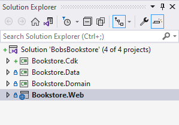
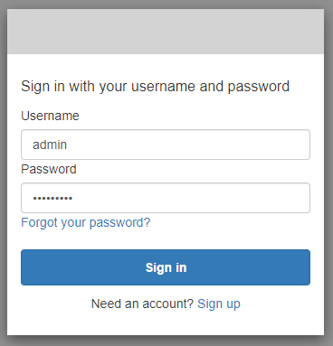
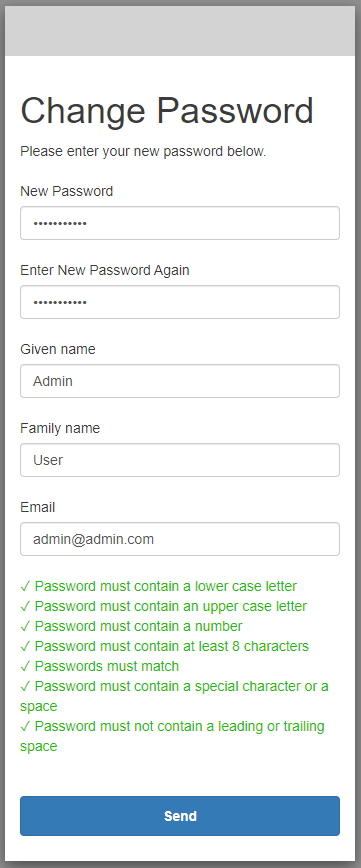

# 'Bob's Used Books' Sample Application

_Bob's Used Books_ is a sample application, built on ASP.NET Core 6.0, that aims to represent a real-world bookstore. It is a monolithic n-tier application with an ASP.NET Core MVC front end and a Microsoft SQL Server database backend.

The MVC application contains a customer portal and an administration portal. The customer portal enables customers to browse the store's stock of used books being offered for sale, select and add them to a shopping cart, and work through a fictional check-out process. Store customers can also offer their own books for resale through the website.

The administration portal is used to maintain the stocks of books available in the store, process customer orders, and other bookstore-related tasks.

In its current state the application illustrates an in-progress "lift and shift" from on-premises to AWS, with partial modernization to use some AWS services. As the sample application progresses over time we have plans to add further modernization examples including (but not limited to) changes such as database modernization and refactoring to microservices.

## Prerequisites

To run and debug the application locally you need the following:
* An IDE that supports .NET 6.0: [Visual Studio 2022](https://visualstudio.microsoft.com/vs/) or [JetBrains Rider](https://www.jetbrains.com/rider/)

To deploy the application to AWS you need the following:
* An AWS IAM User with an attached _AdministratorAccess_ policy
* The [AWS Cloud Development Kit (CDK)](https://docs.aws.amazon.com/cdk/v2/guide/getting_started.html)

## Running the sample application

The web application and supporting projects can be found in the _app_ subfolder of the repository. _Bookstore.Web_ is the ASP.NET Core MVC application front end.

You can run and debug the web application from the repository codebase without needing to create any AWS resources or deploy the application. Optionally, you can also run the web application locally, in a state representing the in-progress lift and shift operation, where a small number of AWS services are used to provide application features such as:

* An object store holding cover images for the store's books, using a private [Amazon S3](https://aws.amazon.com/s3) bucket.
* An [Amazon CloudFront](https://aws.amazon.com/cloudfront) distribution, through which the objects (images) in the bucket are accessed, enabling the bucket to remain private.
* User authentication, for both bookstore staff and customers, using [Amazon Cognito](https://aws.amazon.com/cognito) user pools.
* Secrets management for the database credentials using [Amazon Secrets Manager](https://aws.amazon.com/secrets-manager).
* Application configuration parameters retrieved at runtime from [AWS Systems Manager](https://aws.amazon.com/systems-manager) Parameter Store.

Launch profiles, contained in the application's launchSettings.json file, are used to determine whether you are running the application fully local (no AWS resources) or local with AWS resources. The launch profile that represents a fully local run, without using any AWS services, is called the _Local_ profile. The second profile, in which the application can be run locally but also make use of some AWS services, is called the _Integrated_ profile.

To run the application using the _Integrated_ profile a minimal set of AWS resources need to be provisioned. This is achieved using Infrastructure as Code (IaC) with an [AWS Cloud Development Kit (CDK)](https://aws.amazon.com/cdk) application contained in the _infrastructure/SharedInfrastructure_ folder of the repository. The project in the _infrastructure/SharedInfrastructure/src_ subfolder can be deployed using the CDK's command-line tooling to instantiate the required resources.

**Note 1:** the CDK application in the _infrastructure/SharedInfrastructure/src_ folder creates minimal resources needed for debugging using the _Integrated_ launch profile *or* a full set of resources equating to a "production" deployment. See the [deployment README](./infrastructure/SharedInfrastructure/README.md) file for more details.

**Note 2:** the sample application make use of **localdb** for database connectivity. Therefore, Microsoft Windows is currently required to run these samples.

### Running and debugging with the _Local_ launch profile

Having cloned the repository, the application can be run on a Microsoft Windows workstation without further configuration or deployment.

To run the web application fully local, using no cloud resources, start the **Bookstore.Web** project using the _Local_ profile in your IDE or at the command line. Ports 5000 and 5001 are used for the web application on localhost.

When running under the _local_ profile the application will use a **localdb** instance for database support with the connection string defined in appSettings.Development.json files. User authentication is simulated. Clicking the _Log in_ option results in a transition to an authenticated state, without prompting for username or password, or user sign-up. This enables you to test the work processes in the admin portal, and customer features such as shopping cart, without needing cloud resources. Facades within the application abstract away potential use of AWS services such as Amazon S3 to the local file system.

### Running and debugging with the _Integrated_ launch profile

Prior to using the _Integrated_ launch profile for the web application you need to perform a deployment of the single CDK infrastructure stack, to create and configure a minimum set of AWS resources that the application will use. To deploy the minimal cloud infrastructure needed to support running the application using the _Integrated_ profile, see the [deployment README](./infrastructure/SharedInfrastructure/README.md) file.

Once the CDK deployment has completed:

1. Update the appsettings.Test.json file for the web application, to set a credential profile and region. An example of the required settngs is shown below.

    

    **Note:** These settings are needed as the application will be calling AWS service APIs to access the resources you just provisioned using the CDK. The `Region` property should match the region you told the CDK to deploy to, or `us-west-2` if you accepted the default built into the CDK application. The `Profile` property value should point to credentials that belong to the same account used with the CDK deployment.

Run the  application by starting the **Bookstore.Web** project using the _Integrated_ profile in your IDE or at the command line. Ports 5000 and 5001 are used for the web application on localhost.

### User authentication

In integrated mode, the application uses Amazon Cognito user pools for user authentication and Amazon Cognito user groups for role-based authorization.

On first login to the application you will be asked to change the temporary password.

1. Start the application using the _Integrated_ launch profile.

1. In the application, select _Log in_ from the application toolbar.

1. Sign in using **admin** for the username and **P@ssword1** for the password.

    

1. Because you signed in with a temporary password you are prompted to create a new password and to provide some additional details.

    

You are then signed into the application and placed at the customer portal home page. Because the admin user belongs to the Administrators group you can navigate between the admin portal and the customer portal by following the _Admin Portal_ and _Customer Portal_ links in the top-right corner of the page.

**Note:** The application supports self sign up. When users sign up to Bob's Used Books they are granted access to the customer portal, but not to the administrator portal. Administrators cannot be added via self sign up, they must be added directly in the application's Cognito user pool.

### Tearing down infrastructure

Although minimal resources are created to support the _Integrated_ launch profile of the web application, it may still incur some cost. To avoid charges for unused resources, we recommend you delete the stack containing the infrastructure when you have finished exploring the sample.

**Note:** The application is deployed via multiple CloudFormation stacks. All stacks related to the application are prefixed with _BobsBookstore_. 

To delete resources, either:

1. Navigate to the CloudFormation dashboard in the AWS Management Console, select the stacks you want to delete and delete them.

1. Or, in a command-line shell, set the working folder to be the _infrastructure/SharedInfrastructure_ folder of the repository and run the command `cdk destroy <stack-name>`, replacing `<stack-name>` with the stacks you want to delete. If you supplied `--profile` parameter to the CDK when instantiating the stack, be sure to provide the same ones on deletion, otherwise the CDK command will error out complaining that the stack cannot be found.