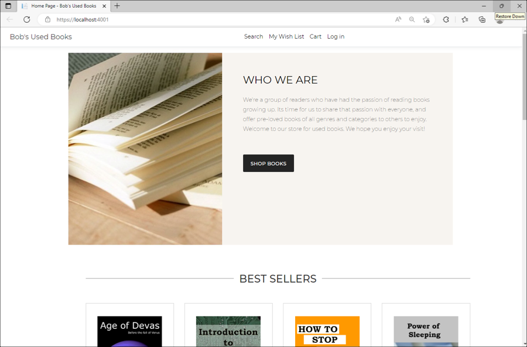
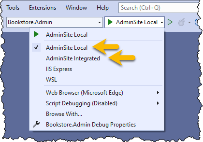
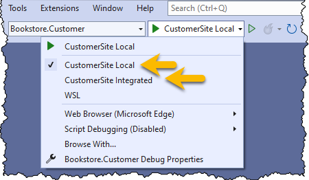
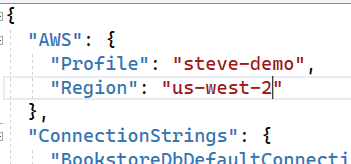
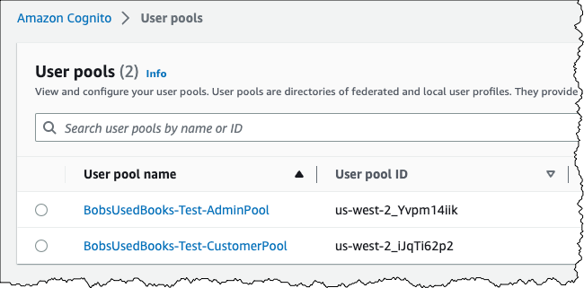
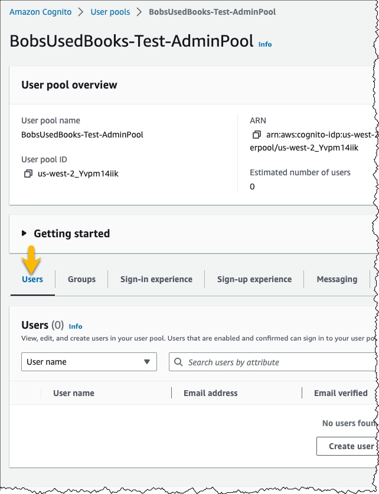
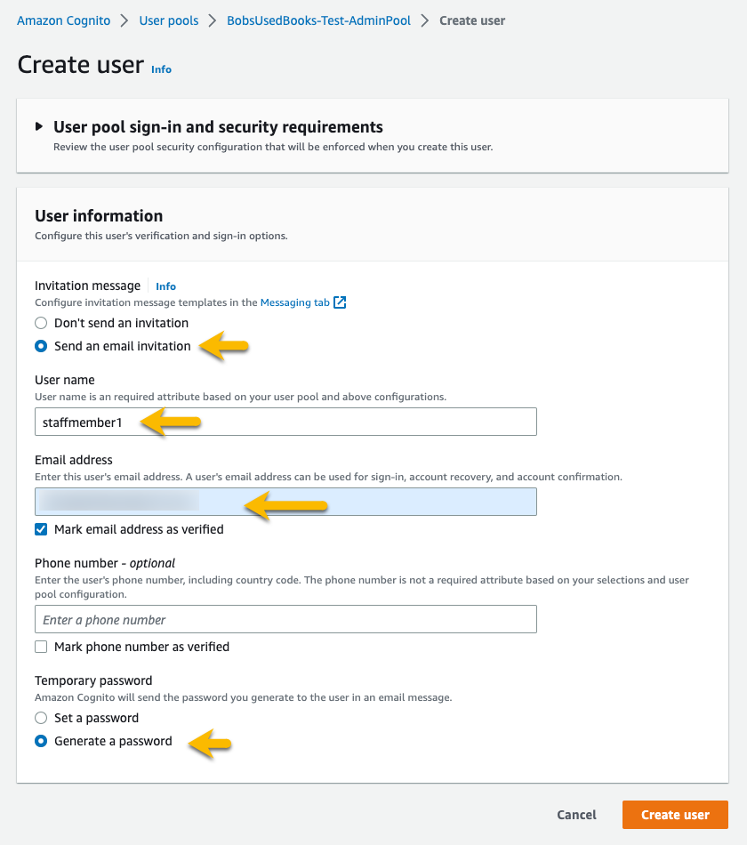

# 'Bob's Used Books' Sample Application

_Bob's Used Books_ is a sample application, built on ASP.NET Core, that aims to represent a real-world bookstore. It consists of two ASP.NET Core MVC web applications. Both the admin and customer web applications make use of a single Microsoft SQL Server database.

The first application is a customer-facing website, enabling customers to browse the store's stock of used books being offered for sale, select and add them to a shopping cart, and work through a fictional check-out process. Store customers can also offer their own books for resale through the website.

The second application is the bookstore's 'admin' website, used by our fictional bookstore staff to maintain the stocks of books available in the store, process customer orders, and other bookstore-related tasks.

In its current state the sample web applications illustrate an in-progress "lift and shift" from on-premises applications to the AWS cloud, with partial modernization to use some AWS services. As the sample application progresses over time we have plans to add further modernization examples including (but not limited to) changes such as database modernization and refactoring to microservices.

## Running the sample applications

Both web applications, and supporting shared projects, can be found in the _app_ subfolder of the repository. _Bookstore.Admin_ is the ASP.NET Core MVC application representing the stores administrative application, and _Bookstore.Customer_ is the ASP.NET Core MVC application representing the customer-facing web site.

You can run and debug both web applications, at the same time, from the repository codebase without needing to create any AWS resources or deploy the applications. Optionally, you can also run both applications locally, in a state representing the in-progress lift and shift operation, where a small number of AWS services are used to provide application features such as:

* An object store holding cover images for the store's books, using a private [Amazon S3](https://aws.amazon.com/s3) bucket.
* An [Amazon CloudFront](https://aws.amazon.com/cloudfront) distribution, through which the objects (images) in the bucket are accessed, enabling the bucket to remain private.
* User authentication, for both bookstore staff and customers, using [Amazon Cognito](https://aws.amazon.com/cognito) user pools.
* Secrets management for the database credentials using [Amazon Secrets Manager](https://aws.amazon.com/secrets-manager).
* Application configuration parameters retrieved at runtime from [AWS Systems Manager](https://aws.amazon.com/systems-manager) Parameter Store.

Launch profiles, contained in the respective application's launchSettings.json files, are used to determine whether you are running the applications fully local (no AWS resources) or local with AWS resources. The launch profile that represents a fully local run, without using any AWS services, is called the _Local_ profile. The second profile, in which the applications can be run locally but also make use of some AWS services, is called the _integrated_ profile.

To run the applications using the _Integrated_ profile a minimal set of AWS resources need to be provisioned. This is achieved using Infrastructure as Code (IaC) with an [AWS Cloud Development Kit (CDK)](https://aws.amazon.com/cdk) application contained in the _infrastructure/SharedInfrastructure_ folder of the repository. The project in the _infrastructure/SharedInfrastructure/src_ subfolder can be deployed using the CDK's command-line tooling to instantiate the required resources.

**Note 1:** the CDK application in the _infrastructure/SharedInfrastructure/src_ folder creates minimal resources needed for debugging using the _Integrated_ launch profiles *or* a full set of resources equating to a "production" deployment. See the [deployment README](./infrastructure/SharedInfrastructure/README.md) file for more details.

**Note 2:** the sample applications make use of **localdb** for database connectivity. Therefore, Microsoft Windows is currently required to run these samples.

### Running and debugging with the _Local_ launch profiles

Having cloned the repository, the admin and customer web site applications can be run, in parallel, on a Microsoft Windows workstation without further configuration or deployment.

1. To run the admin web application fully local, using no cloud resources, start the **Bookstore.Admin** project using the _AdminSite Local_ profile in your IDE or at the command line. Ports 5000 and 5001 are used for the admin site on localhost.

1. To run the customer web application fully local, using no cloud resources, start the **Bookstore.Customer** project using the _CustomerSite Local_ profile in your IDE or at the command line. Ports 4000 and 4001 are used for the customer site on localhost.

When running under the _local_ profiles, both applications will use a **localdb** instance for database support, with the connection string defined in their respective appSettings.Development.json files. User authentication for both applications is simulated. Clicking the respective _Log in_ options in both applications results in a transition to an authenticated state, without prompting for username or password, or user sign-up. This enables you to test the work processes in the admin application, and customer features such as shopping cart, without needing cloud resources. Facades within the applications abstract away potential use of AWS services such as Amazon S3 to the local file system.

### Running and debugging with the _Integrated_ launch profiles

Prior to using the _Integrated_ launch profiles for the web applications you need to perform a deployment of the single CDK infrastructure stack, to create and configure a minimum set of AWS resources that each application will use. To deploy the minimal cloud infrastructure needed to support running the applications using the _Integrated_ profiles, see the [deployment README](./infrastructure/SharedInfrastructure/README.md) file.

Once the CDK deployment has completed:

1. Update the appsettings.Test.json file for **both** of the web applications, to set a credential profile and region. An example of the required settngs is shown below.

    

    **Note:** These settings are needed as the applications will be calling AWS service APIs to access the resources you just provisioned using the CDK. The `Region` property should match the region you told the CDK to deploy to, or `us-west-2` if you accepted the default built into the CDK application. The `Profile` property value should point to credentials that belong to the same account used with the CDK deployment.

1. Run the admin application by starting the **Bookstore.Admin** project using the _AdminSite Integrated_ profile in your IDE or at the command line. Ports 5000 and 5001 are used for the admin site on localhost.

1. Run the customer application by starting the **Bookstore.Customer** project using the _CustomerSite Integrated_ profile in your IDE or at the command line. Ports 4000 and 4001 are used for the customer site on localhost.

### User authentication

In integrated mode, both applications use Amazon Cognito user pools for user authentication.

For the admin site you will need to create a user, representing bookstore staff, in the user pool for the admin site. When creating the fictional staff user, you can elect to have a temporary password auto-generated for you, and an email sent to a valid email address with the password. Alternatively, you can choose to not have an email sent, and set the temporary password yourself. Either way, on first login to the admin application, you will be asked to change the temporary password.

**Note:** The instructions below set the Create User options to (a) have the password emailed to a real email address, and (b) have the password be auto-generated. The screenshots are taken from the new Cognito console experience. If you are running the older experience you may encounter some differences, however the instructional flow holds true.

1. Sign into the AWS Management Console and proceed to the Amazon Cognito dashboard.

1. Select **Manage User Pools** in the Cognito dashboard. Two User Pools belonging to the sample, and created by the CDK application, will be listed - _BobsUsedBooks-Test-AdminPool_ and _BobsUsedBooks-Test-CustomerPool_.

    

1. Select the User Pool for the admin application, _BobsUsedBooks-Test-AdminPool_, to open the pool details view.

1. Choose _Users_ from the tab panel. (If using the old experience, select _Users and Groups_ from the left-side navigation panel.)

    

1. Select **Create user**

1. Select the **Send an email invitation** option. Be sure to enter a real email address later! Alternatively, you can leave this option at "do not email" and set a temporary password yourself later on the form.

1. Complete the User name and Email address fields. You can also mark the email as verified for this sample. Whether you auto-generate the password (and have it emailed), or set a temporary password, you will be asked to change it on first login to the admin application.

    **Note:** For auto-generated passwords, be sure to set the options to have it emailed to you and **be sure to use a real email address to which you have access**!

    

1. Select **Create user** to complete the form. A confirmation email will be sent to the email you enter (this may take a several minutes).

1. On receipt of the email, follow the instructions to verify the email (if necessary) and set a new password.

1. Start the admin application using the _Integrated_ launch profile.

1. In the admin application, select _Log in_ from the application toolbar.

1. Sign in using the username and password you just created.

    

1. Because you signed in with a temporary password you are prompted to update it.

    

You are then signed into the application and placed at the _Orders_ view. You can now access features in the admin application as if you were a staff member of the bookstore, for example to process customer orders, maintain stock, and more.

**Note:** In the customer application, end-users register themselves so as to be more similar to a real-world shopping experience. The process starts using the _Log in_ option on the customer application's toolbar.

### Tearing down infrastructure

Although minimal resources are created to support the _Integrated_ launch profiles of the web applications, it may still incur some cost. To avoid charges for unused resources, we recommend you delete the stack containing the infrastructure when you have finished exploring the sample.

To delete resources, either:

1. Navigate to the CloudFormation dashboard in the AWS Management Console, select the stack you want to delete (_BookstoreIntegratedTest_ or _BookstoreProduction_) and delete it.

1. Or, in a command-line shell, set the working folder to be the _infrastructure/SharedInfrastructure_ folder of the repository and run the command `cdk destroy <stack-name>`, replacing `<stack-name>` with either _BookstoreIntegratedTest_ or _BookstoreProduction_ depending on which stack you created earlier. If you supplied `--profile` parameter to the CDK when instantiating the stack, be sure to provide the same ones on deletion, otherwise the CDK command will error out complaining that the stack cannot be found.

Finally, remove the user pools:

1. Navigate to the Amazon Cognito dashboard in the AWS Management Console.

1. In turn, select and delete each of the two user pools belonging to the sample applications (). For each pool you select:

    1. If using the new Cognito console experience, select **Delete** and enter the name of the pool to confirm.
    1. If using the older Cognito console experience, select **Delete Pool** and enter the text _Delete_ to confirm.
